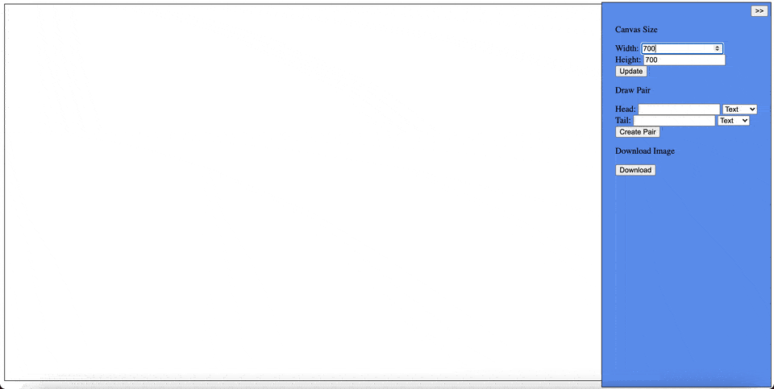

# box-and-pointer
A makeshift program to draw box and pointer diagrams.

I needed a consistent way to generate box and pointer diagrams when creating my teaching materials. Made this quick and dirty program to help me out! Might polish it up and add more features if I find it useful. 

